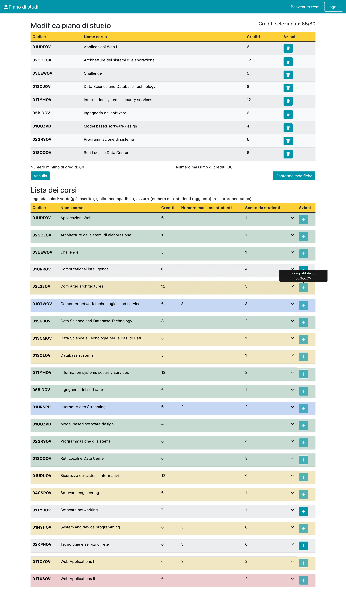

# Exam #1: Piano di studi
## Student: s305535 SANTO LORENZO 

## React Client Application Routes

- Route `/`: Questa è la route principale. Al suo interno vi è la visualizzazione dei diversi componenti gestita in maniera dinamica attraverso l'utilizzo degli stati
- Route `/login`: Attraverso questa route gli studenti non autenticati possono accedere alla loro pagina personale. All'interno vi è un form contenente due campi obbligatori come username e password. Verificata la correttezza delle credenziali si torna alla route /


## API Server

- POST `/api/sessions` __Richiesta Login__
  - request body content:
  ```
  {
    "email": "test@polito.it",
    "password": "password"
  }
  ```
  - Response : `401 Not authenticated`.


- GET `/api/sessions/current`  __Recupera la sessione di uno studente__
```
{
    "id": 3,
    "username": "test@polito.it",
    "name": "test"
}
```
  - Response : `200 OK` `401 Not authenticated`.


- DELETE `/api/sessions/current` __Elimina la sessione di uno studente__
  - Response : `200 OK` (success).


- GET `/api/courses`  __Ritorna tutta la lista dei corsi__
  - response body content:
  ```
  [
    {
        "id": "01UDFOV",
        "name": "Applicazioni Web I",
        "credits": 6,
        "num_students": 1,
        "max_num_students": null,
        "prerequisite": null,
        "course_incompatible": "01TXYOV"
    },
    {
        "code": "02GOLOV",
        "name": "Architetture dei sistemi di elaborazione",
        "credits": 12,
        "num_students": 1,
        "max_num_students": null,
        "prerequisite": null,
        "course_incompatible": "02LSEOV"
    },
  ...
  ]
  ```
  - Response : `500 Internal Server Error` (generic error).
  

- GET `/api/plan` __Ritorna il piano di studi di uno studente__
  - response body content:
  ```
  [
    {
        "id": "01UDFOV",
        "name": "Applicazioni Web I",
        "credits": 20,
        "prerequisite": null,
        "credit": 6,
    },
  ...
  ]
  ```
  - Response : `500 Internal Server Error` (generic error).


- GET `/api/getNumberOfStudent`  __Ritorna il numero di studenti di uno specifico corso__
  - response body content:
  ```
  [
    {
        "id": "01UDFOV",
        "num_students": "3",
    },
  ...
  ]
  ```
  - Response : `500 Internal Server Error` (generic error).


- GET `/api/getTypePlanStudent` __Ritorna il tipo di piano di uno studente__
  - response body content:
  ```
    {
        "type": "Part-Time",
    }
  ```
  - Response : `500 Internal Server Error` (generic error). 


- GET `/api/constraint/:code` __Ritorna propedeuticità e incompatibilità del corso__
  - request boy content: code
  - response body content:
  ```
    {
        "course_incompatible": "",
        "prerequisite": "",
    }
  ```
  - Response : `500 Internal Server Error` (generic error).


- POST `/api/plan` __Controllo vincoli e aggiunta nel db del piano di studi__
  - request body content:
  ```
   [
     {
        "id": "02GOLOV",
        "name": "Architetture dei sistemi di elaborazione",
        "credits": "12",
        "prerequisite": "null",
        "typePlan": "Full-Time",
        "numStudent": "1",
        "max_num_student": "3",
     }
   ]
  ```
  - Response : `201 OK` (success), `422` (validation error), `500 Internal Server Error` (generic error).


- POST `/api/typePlan` __Viene aggiunto il tipo di piano nella tabella PLan__
  - request body content:
  ```
  {
        "id": "1",
        "typePlan": "Part-Time",
  }
  ```
  - Response : `201 OK` (success), `422` (validation error), `503 Database Error` (generic error).


- DELETE `/api/deleteCourses` __Elimina i corsi associati ad uno specifico studente__
  - Response : `204 OK` (success), `503 Database Error` (generic error).


- DELETE `/api/deletePlan` __Elimina il piano di studi di uno studente__
  - Response : `204 OK` (success), `503 Database Error` (generic error).


## Database Tables

- Table `course` - contiene la lista dei corsi con gli attributi: id, name, credits, num_students, max_num_students, prerequisite
- Table `course_has_student` - contiene i corsi che lo studente sceglie. Attributi: id_course, id_student
- Table `incompatibility` - contiene le incompatibilità per ogni corso. Attributi: id, course_incompatible, id_course
- Table `plan` - contiene il tipo di piano scelto dallo studente. Attributi: id_plan, type, id_student
- Table `students` - contiene tutti gli studenti. Attributi: id, email, name, hash, salt


## Main React Components

- `CourseTableComp` (in `CourseTableComp.js`): componente principale con lo scopo di visualizzare l'intera lista dei corsi. Contiene inoltre i controlli dei vincoli (fatti per marcare la riga della tabella in maniera differente)
- `CourseItemComp` (in `CourseItemComp.js`): deriva dal componente descritto sopra. In particolare, questo componente si occupa di visualizzare le righe della tabella e di marcare una riga in base al risultato ottenuto dai controlli dei vincoli nel componente sopra
- `AddPlanComp` (in `AddPlanComp.js`): si occupa dell'aggiunta di un nuovo piano. Viene mostrata la lista dei corsi che uno studente ha selezionato dall'intera lista dei corsi
- `ModifyStudyPlanComp` (in `ModifyStudyPlanComp.js`): si occupa della modifica del piano. Viene mostrata la lista dei corsi che lo studente ha nel piano con la possibilità di eliminare o aggiungere corsi a esso.
- `StudyPlanTableComp` (in `StudyPlanTableComp.js`): contiene il piano di studio dello studente a seguito di aggiunta o modifica. Se non esiste il piano viene mostrato un messaggio per segnalare che nessun piano è compilato 


(only _main_ components, minor ones may be skipped)

## Screenshot



## Users Credentials

- john.doe@polito.it, password 
- pp@polito.it, password 
- test@polito.it, password 
- prova@polito.it, password
- tt@polito.it, password

